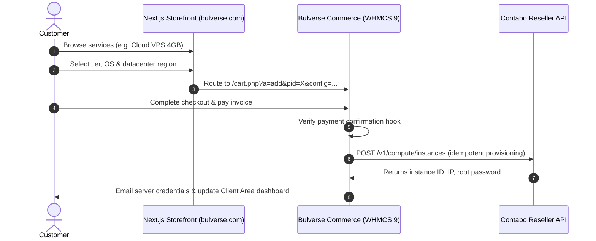

# 01 — Product Requirements Document (PRD)

## 1. Product Overview
Bulverse provides high-performance digital infrastructure products tailored for developers, digital agencies, fintech/trading operators, and scaling online businesses.

---

## 2. Product Matrix & Specifications

### 2.1 Cloud VPS & Servers
* **Description**: Scalable compute instances running KVM virtualization on enterprise NVMe storage.
* **Tiers**:
  * `1–2 GB RAM` (1 vCPU, 30GB NVMe, 32TB Out Traffic) — Dev / microservices
  * `4–6 GB RAM` (2 vCPU, 100GB NVMe, 32TB Out Traffic) — Web apps / staging
  * `8 GB+ RAM` (4–8 vCPU, 200–400GB NVMe) — Production databases & high traffic
  * `Custom` — Scaled RAM/CPU on demand
* **Supported OS**: Ubuntu 22.04/24.04 LTS, Debian 11/12, CentOS Stream / AlmaLinux 9, Windows Server 2022.
* **Controls**: Instant root access, power on/off, hard reboot, OS rebuild, web VNC console, reverse DNS configuration.

### 2.2 Website Hosting
* **Description**: Fast, managed cPanel hosting with automated security and SSL.
* **Tiers**:
  * `Starter`: 1 Website, 10GB NVMe, Unmetered Bandwidth, Free SSL, cPanel
  * `Business`: 5 Websites, 50GB NVMe, Daily Backups, Free SSL, 2x CPU resources
  * `Premium`: Unlimited Websites, 150GB NVMe, Dedicated IP, VIP support
* **Features**: 99.9% Uptime guarantee, 1-click WordPress install, automated daily malware scanning.

### 2.3 Cloud Storage
* **Description**: S3-compatible, ultra-resilient object and block storage with multi-zone replication.
* **Tiers**: `100 GB` • `250 GB` • `500 GB` • `1 TB+`
* **Features**: Automated snapshots, ransomware protection, zero egress penalty within Bulverse network.

### 2.4 Cloud Networking
* **Description**: Enterprise interconnectivity, security, and address allocation.
* **Tiers & Add-ons**:
  * `Dedicated IPv4 / IPv6 Blocks`: Clean reputation IPs for mail and production services.
  * `Anycast DNS`: Sub-10ms global DNS resolution.
  * `Firewall & DDoS Scrubbing`: Layer 3/4 and Layer 7 protection up to 1 Tbps.
  * `Site-to-Site VPN / WireGuard Gateway`: Encrypted team connectivity.

### 2.5 Trading Infrastructure
* **Description**: Ultra-low-latency VPS co-located near primary liquidity centers (Frankfurt, London, New York).
* **Tiers**: `Trading VPS Standard` (2 vCPU, 4GB RAM) • `Trading VPS Pro` (4 vCPU, 8GB RAM, Windows Server GUI).
* **Features**: Sub-millisecond latency to broker gateways, 100% continuous runtime, MT4/MT5 pre-tuned.

### 2.6 Custom Cloud Infrastructure
* **Description**: Dedicated private clouds, customized bare-metal hypervisors, and tailored hybrid setups.
* **Flow**: Request custom quote / enterprise architect consult.

---

## 3. Customer User Journey

---

## 4. Trust Badges & Guarantees
* **99.9% Uptime SLA**: Backed by service credits.
* **High Performance**: 100% PCIe Gen4 NVMe enterprise arrays.
* **Secure by Design**: Isolated virtualization, hardware firewalls.
* **Scalable As You Grow**: Seamless in-place upgrades.
* **24/7 Expert Support**: Real systems engineers on ticketing and chat.
