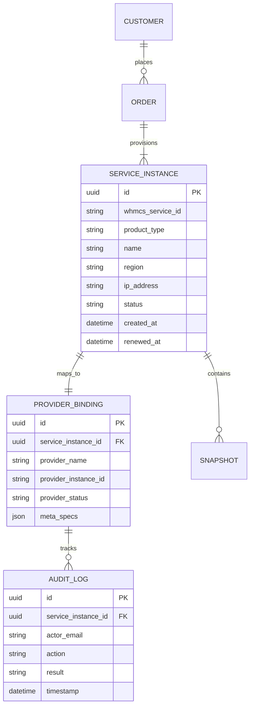

# 04 — Data Model & Boundaries

## 1. Domain Separation
To prevent monolithic lock-in, Bulverse maintains a strict data boundary:
* **WHMCS**: Records commercial transactions, customer identities, payment gateways, invoice statuses, and direct billing subscriptions.
* **Bulverse Control Plane**: Models virtual infrastructure, provider instance mappings, resource telemetry, and state machines.

---

## 2. Infrastructure Entity Model



---

## 3. Provisioning State Machine

```
[PENDING_PAYMENT]
       │
       ▼ (Webhook: Invoice Paid)
[PROVISION_REQUESTED] (Generates Idempotency Key)
       │
       ▼ (API: Provider createInstance)
[PROVISIONING]
       ├── (Timeout/Error) ──► [RETRY_QUEUE] (Exponential Backoff, max 3)
       │                              │
       │ (Success)                    ▼ (Exhausted)
       │                        [PROVISION_FAILED] (Ticket Alert to Ops)
       ▼
[ACTIVE] (IP Assigned, Root Credentials Generated)
       │
       ├── (Invoice Overdue) ──► [SUSPENDED] (Provider powerOff)
       │                              │
       │                              ├── (Paid) ──► [ACTIVE] (powerOn)
       │                              ▼ (30 Days Unpaid)
       └── (Customer Cancel) ──► [TERMINATED] (Provider deleteInstance)
```

---

## 4. Idempotency Key Specification
Every provisioning request to an infrastructure provider must carry a deterministic key:
$$\text{IdempotencyKey} = \text{SHA256}(\text{WHMCS\_ORDER\_ID} + \text{SERVICE\_ID} + \text{PRODUCT\_CODE})$$
If a network timeout occurs while provisioning, the retry job sends the exact same key to ensure Contabo/Vultr deduplicates the request rather than launching duplicate paid hardware.
