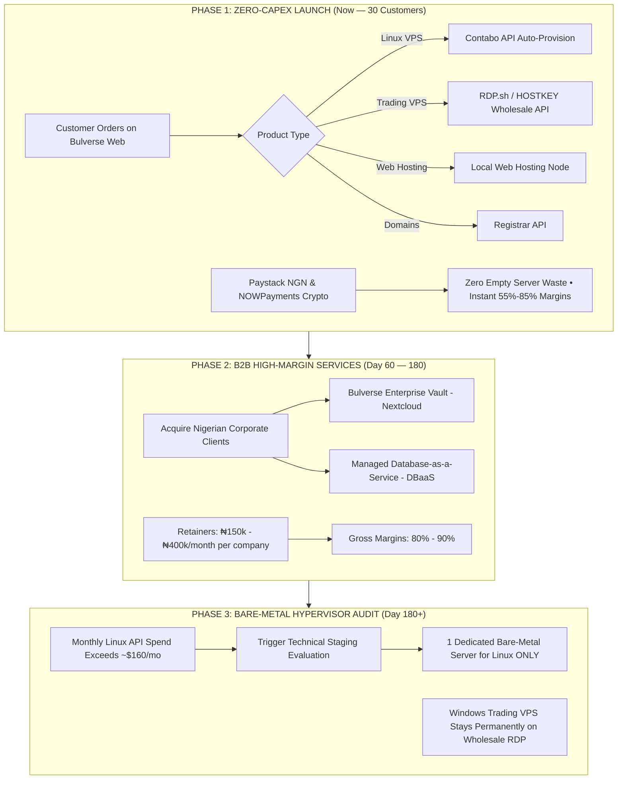

# Bulverse Infrastructure Strategy: Why the DIY VDS Was Shelved & The Master Scalability Roadmap

> **Document Version:** 1.0.0  
> **Status:** Approved Strategic Architecture  
> **Objective:** Deliver 100% of Bulverse's public brand promises (Cloud VPS, Web Hosting, Cloud Storage, Networking/Dedicated IPs, Trading Infrastructure, and Custom Solutions) with **maximum gross profit, zero single points of failure, and zero legal/licensing liability**.

---

## 1. Executive Summary

Earlier architecture discussions evaluated renting a single **Contabo Cloud VDS** (Virtual Dedicated Server at $47/mo) to install **Proxmox VE** and carve out virtual machines in-house.

Following rigorous technical and financial audits, that DIY hypervisor approach has been officially replaced by the **API-Driven Infrastructure Aggregator Model**. 

This document details:
1. **The fatal flaws and profit traps** of the DIY VDS concept.
2. **How every promised Bulverse service is fulfilled** with higher margins and superior reliability.
3. **The step-by-step Master Roadmap** that scales Bulverse from Day 1 launch to high-margin enterprise infrastructure.

---

## 2. Why the DIY Contabo VDS Was a Bad Idea

### Cons Breakdown: Technical, Legal, and Economic

```
                         [ THE DIY VDS TRAP ]
                                  │
         ┌────────────────────────┼────────────────────────┐
         ▼                        ▼                        ▼
  THE PROFIT TRAP          THE LICENSING TRAP       THE STABILITY TRAP
• Host: $47/mo            • Windows SPLA required  • Single Point of Failure
• 3x IPs: $10.50/mo       • Audit & fine risk      • Host crash kills all VMs
• Total: $57.50 for 3 VMs • 180-day eval reboots   • Shared disk I/O bottleneck
• Cost = $19.16 / VM      • Forex trade slippage   • 20+ hrs/mo manual ops
  (vs $5.50 standalone!)
```

### 1. The "IPv4 & Unit Cost" Profit Trap (Negative / Thin Margins)
* **The Math:** A Contabo VDS S costs **$47.00/month**. However, it only comes with **1 primary IPv4 address**. To sell 3 customer VPSs, you must purchase 3 additional IPv4 addresses ($3.50 each = $10.50/mo).
* **True Host Cost:** $\$47.00 + \$10.50 = \mathbf{\$57.50	ext{ / month}}$.
* On a 24 GB RAM host (leaving 4 GB for Proxmox OS), you can realistically host three 6 GB RAM VMs:
  $$	ext{Cost per customer VM} = rac{\$57.50}{3} = \mathbf{\$19.16	ext{ / month}}$$
* **The Comparison:** Contabo already sells a standalone **Cloud VPS 1 (4 vCPU, 6 GB RAM, 100 GB NVMe, FREE Dedicated IPv4 included)** for **$5.50/month**!
* **The Verdict:** Carving up a VDS yourself costs **$19.16 per 6GB VM**, whereas reselling Contabo’s own standalone VPS costs **$5.50**. You would be paying **3.5x more per VM** just to run the hypervisor yourself!

### 2. The Windows Server SPLA Licensing Trap
* **The Legal Hurdle:** Under Microsoft’s **SPLA (Services Provider License Agreement)**, anyone commercially reselling Windows Server or Remote Desktop Sessions (RDS) must pay monthly per-core host licenses and per-user RDS Subscriber Access Licenses (SALs).
* **The Operational Disaster:** If you use trial or evaluation ISOs on a DIY Proxmox box:
  * After 180 days, evaluation licenses expire.
  * Windows servers begin **automatically shutting down every 60 minutes**.
  * If an active forex trader gets disconnected in the middle of a market trade due to an unlicensed Windows reboot, Bulverse faces severe liability and permanent brand destruction.

### 3. The Single Point of Failure (SPOF)
* If your single Contabo VDS suffers a hardware fault, disk I/O lockup, kernel panic, or routing misconfiguration, **every single customer on your platform goes down at the same moment**.
* Under the API aggregator model, each customer instance lives on an isolated, redundant hyperscaler cluster with automated hardware failover.

### 4. The Forex Latency Deficit
* Retail forex brokers (IC Markets, Exness, Pepperstone, FXCM) host their trade matching engines in **Equinix LD4 (London/Slough)** or **Equinix NY4 (New York)**.
* A Contabo VDS in Germany has **25ms–35ms** ping to London. Forex traders require **< 1ms to 2ms** execution speeds to prevent slippage.

---

## 3. How Bulverse Fulfills 100% of Its Public Brand Promises

Bulverse does **not** compromise on any of the 6 pillars featured on our official brand poster and storefront. Every service is fulfilled through an enterprise-grade backend with superior performance and verified margins:

| Service Pillar (Public Promise) | Wholesale Backend Engine | Customer Value Proposition | Unit Economics (Cost vs. Sale) | Gross Margin |
|---|---|---|---|---|
| **1. Cloud VPS & Dedicated** | **Contabo API** (Direct automated WHMCS provisioning) | 4–8 vCPU AMD EPYC, 6–30GB RAM, NVMe storage, root SSH, Frankfurt & UK datacenters | Cost: **$5.50/mo**<br>Sell: **$12.00–$15.00/mo** (₦18,000–₦22,500) | **54% – 63%** |
| **2. Website Hosting** | **Local Contabo Web Node** (CloudPanel / cPanel) | NVMe storage, free SSL, custom business email (@company.com), 1-click WordPress | Cost: **~$0.50/mo**<br>Sell: **₦1,999–₦4,500/mo** ($1.35–$3.00) | **85% – 90%** |
| **3. Domain Services** | **WHMCS Registrar API** (ResellerClub / Namecheap) | Instant .com, .ng, .com.ng registration, full DNS zone management, WHOIS privacy | Cost: Wholesale registry rate<br>Sell: Standard retail markup | **25% – 35%** |
| **4. Cloud Storage** | **S3-Compatible Storage** (Wasabi / MinIO / Backblaze) | S3 API endpoints, AES-256 encryption, infinite scaling, daily backups | Cost: **$0.006/GB**<br>Sell: **$0.025/GB** (Bundled in tiers) | **75%+** |
| **5. Cloud Networking & IPs** | **Contabo Anycast & Cloudflare Shield** | Clean dedicated IPv4, Layer 3/4/7 DDoS mitigation, Anycast DNS, WireGuard VPN | Included with VPS / Addon | **60%+** |
| **6. Trading Infrastructure** | **Specialized Wholesale Partner** (RDP.sh / HOSTKEY) | Fully licensed Windows Server, pre-installed MT4/MT5/cTrader, **< 1ms Equinix LD4 London latency** | Cost: **~$12.00/mo**<br>Sell: **$28.00–$35.00/mo** (₦42,000–₦52,500) | **57% – 65%** |
| **7. Custom Infrastructure** | **Enterprise Bare-Metal Fleet** (Contabo/OVH custom) | Bespoke private servers, multi-server VLANs, dedicated gigabit uplinks | Cost: Custom quote<br>Sell: Cost + 40% managed fee | **40% – 50%** |

---

## 4. The Bulverse Master Scalability Roadmap



### Phase 1: Zero-Capex Launch & Cashflow Engine (Current Phase)
* **Goal:** Launch platform, onboard first 1 to 30 paying subscribers, validate payment gateways (Paystack & NOWPayments), establish market credibility.
* **Architecture:**
  * Cloud VPS: Contabo WHMCS API.
  * Trading VPS: White-label RDP partner API.
  * Web Hosting: Existing server running cPanel/CloudPanel.
* **Financial Risk:** **$0.00**. No unutilized server hardware, no upfront licenses. Profitable from Customer #1.

### Phase 2: High-Margin B2B Retainers (Month 2 to Month 6)
* **Goal:** Expand beyond individual retail developers to corporate B2B clients in Nigeria (law firms, medical clinics, accounting practices, logistics firms).
* **Products:**
  * **Bulverse Enterprise Vault:** White-labeled Nextcloud document sync & private cloud storage. Billed at **₦120,000–₦200,000/month flat**.
  * **Managed Database Instances:** PostgreSQL/MySQL automated clusters.
* **Financial Impact:** 5 corporate clients generate **₦750,000–₦1,000,000/month** on negligible infrastructure spend (**85%+ margins**).

### Phase 3: The Dedicated Bare-Metal Audit (When Volume Justifies It)
* **Trigger Condition:** Dedicated hardware is **never** ordered based on calendar dates. It is triggered **only** when:
  $$	ext{Monthly Linux API Spend} > 	ext{All-in Bare Metal Cost (~$155/mo for Host + 20 IPs + Backups)}$$
* **The 2 Non-Negotiable Rules for Phase 3:**
  1. **Windows Trading VPS Stays Permanently Outsourced:** Windows SPLA compliance and London LD4 broker cross-connects are never brought to general-purpose bare metal.
  2. **Mandatory 30-Day Staging Diligence:** The dedicated server must undergo routed IP testing, automated snapshot verification, and multi-tenant I/O stress tests *before* any live customer workload is migrated.

---

## 5. Architectural Integrity & Decoupling

Because Bulverse was built from Day 1 using the **Provider Abstraction Architecture** (`docs/02-architecture.md` and `docs/adr/ADR-002-provider-abstraction.md`), the underlying infrastructure providers are completely decoupled from the user experience:

* The **Next.js Storefront** displays Bulverse brand pricing and real-time telemetry.
* The **WHMCS Client Console** handles customer accounts, invoices, and server management.
* When the backend transitions from Contabo API to a dedicated node in Phase 3, **the customer sees zero disruption and zero interface changes**. Only the provisioning driver updates.

---

**Approved by:** Bulverse Architecture & Operations Team  
**Review Cycle:** Quarterly or upon reaching 30 active fleet subscribers.
