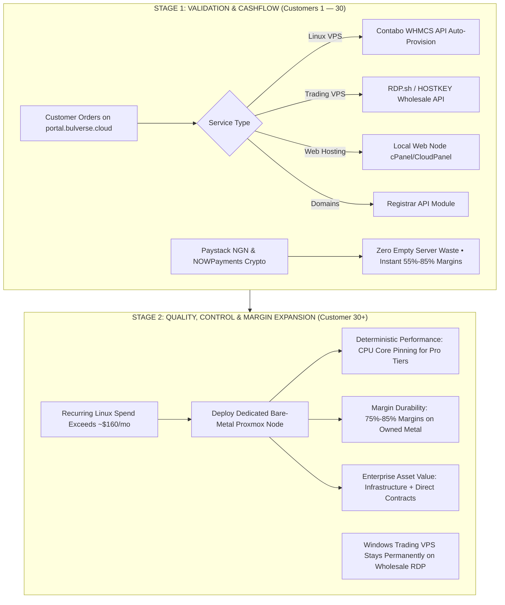

# BULVERSE — Infrastructure Strategy & Master Roadmap

> **Document Type:** Executive Architecture & Strategy Brief  
> **Status:** Approved Production Roadmap  
> **Target Audience:** Executive Leadership, Technical Operations & Commercial Strategy

---

## 1. Executive Summary: The Strategic Pivot

We originally evaluated renting a single **Contabo Cloud VDS** (Virtual Dedicated Server at ~$47/mo) to install **Proxmox VE** and carve out customer virtual machines in-house. 

After running the real-world unit economics, legal licensing audits, and latency benchmarks, we officially pivoted to an **API-Driven Infrastructure Aggregator Model** for Stage 1.

This pivot is not a compromise—it is an upgrade:
* **Zero Capital Waste:** We launch immediately without paying for empty compute while building our initial subscriber base.
* **Superior Unit Margins:** We buy standalone hyperscaler instances via API for less than it would cost to carve them out of a VDS ourselves.
* **Eliminates Legal Exposure:** Solves the Windows Server SPLA licensing gap for trading workloads.
* **Sets Up a Clean Stage 2 Transition:** Allows us to move to our own dedicated hardware later as a deliberate **Quality & Control play**, rather than a risky launch experiment.

---

## 2. Why the Contabo VDS Plan Failed the Math & Legal Test

The Contabo Cloud VDS proposal was thoroughly evaluated against real-world operational realities. It failed on three major fronts:

```
                            [ THE CONTABO VDS DILEMMA ]
                                         │
                 ┌───────────────────────┴───────────────────────┐
                 ▼                                               ▼
     THE IPv4 & UNIT COST PARADOX                    THE WINDOWS SPLA LICENSING GAP
  • Contabo VDS S Host: $47/mo                    • Microsoft SPLA required for retail RDP
  • 3x Addon IPv4s ($3.50/ea): $10.50/mo          • 180-day trial ISOs trigger 60-min reboots
  • Total Host Cost: $57.50 for 3 VMs             • Disastrous trade slippage for forex clients
  • Cost per 6GB VM: $19.16 / month               • Partnering with licensed hosts solves it
  • Standalone Contabo VPS 1: $5.50 / month!
```

### 1. The IPv4 & Unit Cost Paradox (The VDS Was More Expensive, Not Cheaper)
* **The Math:** A Contabo Cloud VDS S costs **$47.00/month**, but it only comes with **1 primary IPv4 address**. To sell customer VPSs, every customer requires a dedicated public IPv4. Contabo charges **$3.50/month** per additional IP.
* Adding 3 IPs brings the raw host cost to **$57.50/month**.
* Splitting the VDS's 24 GB of RAM (reserving 4–6 GB for the Proxmox hypervisor and host OS) allows realistically hosting three 6 GB RAM customer VMs:
  $$\text{Cost per customer VM on VDS} = \frac{\$57.50}{3} = \mathbf{\$19.16\text{ / month}}$$
* **The Contrast:** Contabo already sells a standalone **Cloud VPS 1 (4 vCPU, 6 GB RAM, 100 GB NVMe, with a FREE dedicated IPv4 included)** for **$5.50/month**!
* **The Conclusion:** Carving up a VDS yourself costs **$19.16 per VM**, whereas reselling Contabo’s own standalone instance via API costs **$5.50**. You would be paying **3.5x more per customer** just to run the hypervisor yourself. Contabo subsidizes IPv4 costs at hyperscale; a single VDS cannot compete with that math.

### 2. The Windows Server SPLA Licensing & 180-Day Reboot Trap
* **The Legal Hurdle:** Under Microsoft’s **SPLA (Services Provider License Agreement)**, commercially renting Windows Server or Remote Desktop (RDP) environments to third parties requires monthly per-core host licensing and per-user RDS Subscriber Access Licenses (SALs).
* **The Operational Risk:** If you run evaluation or retail ISOs on a self-managed Proxmox host:
  * Evaluation licenses expire after 180 days.
  * Windows automatically begins **shutting down every 60 minutes**.
  * For retail forex traders running MetaTrader 4/5 or cTrader Expert Advisors (EAs), an unannounced server reboot during high-impact market news (NFP, FOMC) causes missed stop-losses and severe trade slippage.
* **The Fix:** Routing Trading VPS through specialized wholesale partners (e.g. **RDP.sh** or **HOSTKEY**) completely removes this risk. They carry enterprise SPLA agreements; Windows licenses and RDS CALs are legally bundled into the wholesale price.

### 3. Forex Broker Latency Realities
* Retail forex brokers (IC Markets, Exness, Pepperstone, FXCM) host their trade matching engines in **Equinix LD4 (London/Slough)** or **Equinix NY4 (New York)**.
* A general Contabo VDS in Germany has **25ms–35ms** network latency to London. Real algorithmic traders require **low, single-digit millisecond latency**, which specialized trading hosts deliver through dedicated cross-connects.

---

## 3. How Each Bulverse Service Is Delivered Today

Bulverse fulfills **100% of the services promised** on our brand poster and storefront. Every service is backed by an established wholesale engine, automated through WHMCS, with verified profit margins:

| Service Pillar | How It Is Delivered | What the Customer Receives | Cost vs. Sale Price | Gross Margin |
|---|---|---|---|---|
| **Cloud VPS & Servers (Linux)** | **Contabo API** (Automated WHMCS provisioning) | High-performance AMD EPYC, 6–30GB RAM, NVMe storage, dedicated IPv4, root SSH | Cost: **$5.50/mo**<br>Sell: **$12.00–$15.00/mo** (₦18k–₦22.5k) | **~55% – 63%** |
| **Website Hosting** | **Local Web Node** (Contabo server running cPanel/CloudPanel) | Shared NVMe hosting, free SSL, custom business email (@brand.com), 1-click WordPress | Cost: **~$0.50/client**<br>Sell: **₦1,999–₦4,500/mo** ($1.35–$3.00) | **~85% – 90%** |
| **Domain Services** | **WHMCS Registrar API** (ResellerClub / Namecheap) | Instant .com, .ng, .com.ng registration, full DNS zone management, WHOIS privacy | Cost: Registry wholesale rate<br>Sell: Standard retail markup | **~25% – 35%** |
| **Cloud Storage** | **S3-Compatible Backend** (Wasabi / MinIO / Backblaze) | Encrypted object storage (AES-256), S3 API endpoints, automated backups | Cost: **$0.006/GB**<br>Sell: **$0.025/GB** (bundled in tiers) | **~75%+** |
| **Cloud Networking & IPs** | **Contabo Anycast + Cloudflare Edge** | Clean dedicated public IPv4, DDoS Layer 3/4/7 mitigation, WireGuard VPN | Cost: Included in VPS / Addon | **~60%+** |
| **Trading Infrastructure (Windows)** | **Licensed Wholesale Reseller** (RDP.sh / HOSTKEY) | Genuine Windows Server, pre-installed MT4/MT5/cTrader, low single-digit ms London/NY latency | Cost: **~$12.00/mo**<br>Sell: **$28.00–$35.00/mo** (₦42k–₦52.5k) | **~55% – 60%** |
| **Custom Cloud Infrastructure** | **Enterprise Bare-Metal Fleet** (Contabo/OVH custom) | Bespoke bare-metal clusters, multi-server VLANs, dedicated gigabit uplinks | Cost: Custom quote<br>Sell: Cost + 40% managed fee | **~40% – 50%** |

---

## 4. The Two-Stage Master Roadmap



### Stage 1: Validation, Zero Capex & Cashflow (Customers 1 – 30)
* **Strategy:** Every advertised service is delivered via partner APIs. Zero physical servers purchased upfront.
* **Core Objectives:**
  * Validate payment gateways (Paystack for NGN debit/bank transfer, NOWPayments for Crypto).
  * Build brand trust and operational muscle.
  * Measure true Customer Acquisition Cost (CAC) and keep monthly churn under 5%.
* **Financial Position:** **$0.00 capital risk**. Every customer order is profitable from Day 1.

---

### Stage 2: The Quality, Control & Margin Expansion Play (Customer 30+)

The transition to dedicated Proxmox bare metal is **not just a revenue play—it is a Quality and Control play.**

When customer volume grows, owning bare-metal hardware unlocks four strategic wins:
1. **Deterministic Performance (CPU Core Pinning):**  
   Budget VPS providers heavily overcommit CPU cores. During high-impact news events, noisy neighbors cause latency spikes. On your own bare-metal Proxmox server, you control CPU pinning. "Pro" tier customers get dedicated, unshared physical cores that never throttle.
2. **Margin Durability:**  
   Once you host 30–50 workloads on your own metal, your unit cost per Linux instance drops to ~$2.50–$3.00/month. Your gross margins expand to **75%–85%**, fully insulated from third-party price increases.
3. **A Defensible Enterprise Asset:**  
   In business valuation, a company that owns its hypervisor infrastructure and direct customer contracts is worth multiples of a pure reseller agreement.
4. **B2B High-Margin Retainers:**  
   Allows launching **"Bulverse Enterprise Vault"** (Nextcloud enterprise document storage) and Managed Databases for Nigerian companies at **₦150,000–₦350,000/month flat retainers** with 85%+ margins.

---

### Non-Negotiable Rules of Engagement for Stage 2

To prevent re-introducing earlier risks, Stage 2 adheres to four strict operational rules:

1. **Windows Trading VPS Stays Permanently on Wholesale RDP Partners:**  
   SPLA licensing commitments (which require licensing every physical CPU core on the host at hundreds of dollars/month) and physical Equinix LD4 cross-connects will never be brought in-house. Linux compute runs on Bulverse metal; Windows Trading RDP stays with licensed specialists.
2. **No Overselling (The Anti-Contabo Rule):**  
   The primary value of Stage 2 is **trust and performance**. We will not cram nodes full to squeeze an extra dollar. Density will be strictly governed to guarantee that when a customer pays for 4 cores, those cores are fast, quiet, and stable.
3. **Mandatory 30-Day Staging Diligence:**  
   Before any customer is placed on owned bare metal, the node undergoes a 30-day staging evaluation: testing routed IP subnets, off-box S3 backup/restore drills, and multi-tenant disk I/O stress tests.
4. **Zero Disruption for Stage 1 Customers:**  
   Existing Phase 1 customers who are happy on the partner API model are never forced to migrate. The dedicated node absorbs *new* signups and upgraded "Pro" tiers, eliminating migration downtime and IP whitelist breaks.

---

## 5. Bottom Line

* **Day 1 Launch:** Resell via API $
ightarrow$ Zero hardware cost $
ightarrow$ Zero licensing risk $
ightarrow$ Immediate 55%–85% profit margins.
* **Day 180+ Scale:** Deploy dedicated Proxmox bare metal for Linux $
ightarrow$ True core pinning $
ightarrow$ Insulated margins $
ightarrow$ Premium enterprise asset.

This delivers every promise made to our customers from day one, protects our capital, and gives Bulverse a clean, defensible path to becoming a major infrastructure brand.
